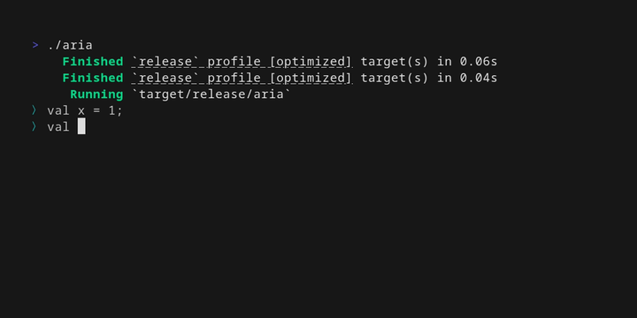

# What's New in Aria - August 2025

It’s been about a month since Aria went open source, and the project has moved fast. This month brought interactive exploration tools, new standard library capabilities, and core language features that make Aria more powerful and pleasant to use. Here’s what’s new in August.

## REPL

Interactive exploration is here. The new REPL lets you try ideas on the fly without writing full programs!

 
Click to view REPL demo

---

## Library upgrades
* **Iterators with new tricks** — Thanks to [Enrico Bolzonello](https://github.com/enricobolzonello), iterators gained powerful [new capabilities](https://github.com/egranata/aria/commit/8d1cb9e2fc7600e0137718d9ee9d38314f735f19).

* **Better date/time handling** — `Instant` can now create values in the local timezone. Also fixed: a December timestamp [bug](https://github.com/egranata/aria/commit/b15ba4e302668d781f78986f783ef544e1c6f185).

* **Flexible integer parsing** — `Int` now supports multiple [bases](https://github.com/egranata/aria/commit/0f4a083c5a58c54238730e763fef600304954b1a) beyond 10.

---

## Core language improvements

* **macOS support** — Official build and test workflows now cover [macOS](https://github.com/egranata/aria/actions/workflows/macos_build_test.yml/badge.svg?branch=master) (once again thanks to Enrico Bolzonello).

* **Default arguments** — Functions can accept [default parameter values](https://github.com/egranata/aria/pull/101).

* **Better Unicode support** — Fixed a [bug](https://github.com/egranata/aria/commit/17d95fe056ba4649364a818cdd00b4f2e52be24c) where Unicode text broke error traces. String's `len` and indexing now both use characters as the source of truth.

* **Cleaner operator overloading** — [No more](https://github.com/egranata/aria/commit/c475e9f2d2afce31762ae80d01170ee930d6d7be) `func op_add`; now just write `operator +`.

Try the latest Aria features today — clone the [repo](https://github.com/egranata/aria), explore the REPL, and see what’s possible.
